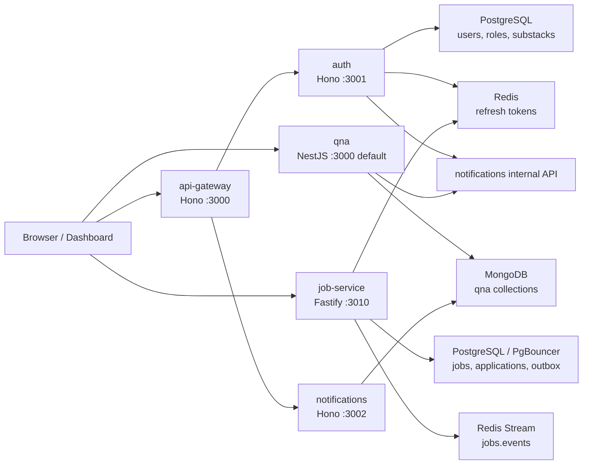
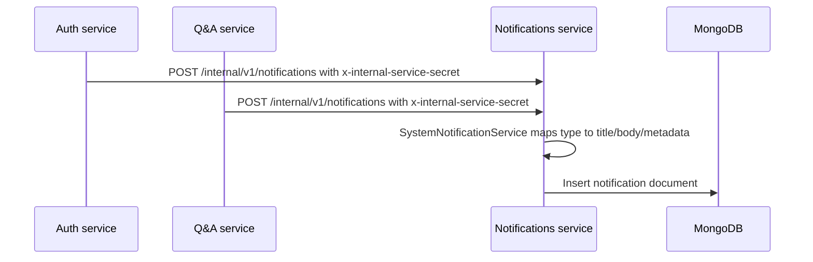
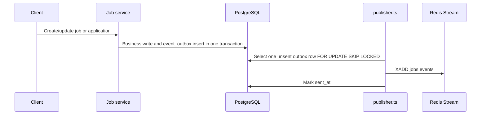

# Solvit Architecture

This document describes the architecture currently implemented in this repository. It is based on the source code under `packages`, `workspaces`, and `@types` as of this review.

## High-level shape

Solvit is a TypeScript monorepo managed by pnpm workspaces and Turborepo. It contains shared domain/node packages plus several deployable workspaces:

- `workspaces/api-gateway`: public Hono API gateway.
- `workspaces/auth`: Hono auth, user, subscription, and substack service.
- `workspaces/notifications`: Hono notification service backed by MongoDB.
- `workspaces/qna`: NestJS Q&A service backed by MongoDB.
- `workspaces/job-service`: Fastify job and job application service backed by PostgreSQL and Redis.
- `workspaces/dashboard`: TanStack Start/Vite dashboard frontend.



## Monorepo organization

The root `package.json` defines workspace-wide scripts:

- `pnpm dev`: runs all `dev` tasks through Turbo in parallel.
- `pnpm build`: builds workspace packages with dependency ordering.
- `pnpm test`: runs Vitest coverage for configured projects.

Workspace packages are declared in `pnpm-workspace.yaml`:

- `@types/**`
- `packages/**`
- `workspaces/**`

Shared packages:

- `packages/@domain/core`: `ICommand`, `IQuery`, `BaseUuid`, and core type contracts.
- `packages/@domain/auth`: auth/user/substack schemas, entities, repository interfaces, and error constants.
- `packages/@domain/notification`: notification schemas, entity, and repository interface.
- `packages/@node/hono`: reusable Hono middleware for IoC registration, Drizzle/Mongoose context injection, and internal service authentication.
- `packages/@node/drizzle`: shared Drizzle base schemas for id/timestamps.
- `packages/@node/utils`: small node utilities, currently pagination parsing.
- `@types/globals`: global TypeScript declarations.

## Runtime services

### API Gateway

Path: `workspaces/api-gateway`

Framework: Hono on `@hono/node-server`, default port `3000`.

Responsibilities:

- Accepts public HTTP traffic.
- Manages HTTP-only auth cookies for sign-up, sign-in, and refresh responses.
- Authenticates protected routes by calling the Auth service profile endpoint.
- Proxies Auth and Notification service responses.

Main routes:

- `GET /health`
- `POST /v1/auth/sign-up`
- `POST /v1/auth/sign-in`
- `POST /v1/auth/refresh`
- `POST /v1/auth/users/:userId/subscribe`
- `DELETE /v1/auth/users/:userId/subscribe`
- `GET /v1/notifications`

Important source files:

- `workspaces/api-gateway/src/adapters/restful/hono/index.ts`
- `workspaces/api-gateway/src/adapters/restful/hono/middlewares/authMiddleware.ts`
- `workspaces/api-gateway/src/services/AuthService.ts`
- `workspaces/api-gateway/src/services/NotificationService.ts`

### Auth Service

Path: `workspaces/auth`

Framework: Hono on `@hono/node-server`, default port `3001`.

Persistence:

- PostgreSQL through Drizzle for users, roles, user subscriptions, substacks, substack roles, role assignments, and substack subscriptions.
- Redis for refresh-token allow-list entries.

Responsibilities:

- User sign-up, sign-in, token refresh, and profile lookup.
- User-to-user subscribe/unsubscribe behavior.
- Substack listing, creation, approval, subscribe, and unsubscribe behavior.
- Emits internal notification requests for auth/social/substack events.

Main routes:

- `GET /health`
- `POST /v1/auth/sign-up`
- `POST /v1/auth/sign-in`
- `POST /v1/auth/refresh`
- `GET /v1/auth/profile`
- `POST /v1/auth/users/:userId/subscribe`
- `DELETE /v1/auth/users/:userId/subscribe`
- `GET /v1/substacks`
- `GET /v1/substacks/:slug`
- `POST /v1/substacks`
- `POST /v1/substacks/:slug/subscribe`
- `DELETE /v1/substacks/:slug/subscribe`
- `POST /admin/substacks/:slug/approve`

Layering:

- Hono endpoints handle HTTP and validation.
- IoC registration wires command/query classes to repositories.
- Application commands/queries implement use cases.
- Repositories implement persistence against Drizzle or Redis.
- Domain package entities convert database records into application objects.

Important source files:

- `workspaces/auth/src/adapters/restful/hono/index.ts`
- `workspaces/auth/src/modules/auth/adapters/restful/hono/endpoints/portal/auth.ts`
- `workspaces/auth/src/modules/substack/adapters/restful/hono/endpoints/portal/substacks.ts`
- `workspaces/auth/src/modules/auth/application/portal/v1/commands/*`
- `workspaces/auth/src/modules/substack/application/**`
- `workspaces/auth/src/infrastructure/drizzle/schemas/*`
- `workspaces/auth/src/modules/auth/infrastructure/redis/repositories/AllowedTokenRepository.ts`

### Notifications Service

Path: `workspaces/notifications`

Framework: Hono on `@hono/node-server`, default port `3002`.

Persistence:

- MongoDB through Mongoose.

Responsibilities:

- Stores notifications.
- Lists and marks notifications as read.
- Accepts internal system notification events from trusted services.
- Converts typed system notification payloads into user-facing title/body/metadata records.

Main routes:

- `GET /health`
- `GET /v1/notifications?userId=...&read=...&limit=...`
- `PATCH /v1/notifications/:id/read?userId=...`
- `POST /internal/v1/notifications`
- `POST /internal/v1/notifications/batch`

Internal routes require the `x-internal-service-secret` header to match `INTERNAL_SERVICE_SECRET`.

Important source files:

- `workspaces/notifications/src/adapters/restful/hono/index.ts`
- `workspaces/notifications/src/modules/notification/adapters/restful/hono/endpoints/portal/notifications.ts`
- `workspaces/notifications/src/modules/notification/adapters/restful/hono/endpoints/internal/notifications.ts`
- `workspaces/notifications/src/modules/notification/domain/services/SystemNotificationService.ts`
- `workspaces/notifications/src/infrastructure/mongoose/schemas/notifications.ts`

### Q&A Service

Path: `workspaces/qna`

Framework: NestJS, default port `3000` unless `PORT` is set.

Persistence:

- MongoDB through Nest Mongoose.

Responsibilities:

- Topics, comments, votes, and topic subscriptions.
- Text search and aggregate counts for topic listings.
- Sends internal notification requests for Q&A vote events.

Main routes:

- `POST /topics`
- `GET /topics/search`
- `GET /topics/:id`
- `GET /topics/:id/comments`
- `PATCH /topics/:id`
- `PATCH /topics/:id/solve`
- `DELETE /topics/:id`
- `POST /topics/:id/subscribe`
- `POST /topics/:id/unsubscribe`
- `POST /topics/:id/vote`
- `DELETE /topics/:id/vote`
- `POST /comments`
- `PATCH /comments/:id`
- `PATCH /comments/:id/accept`
- `DELETE /comments/:id`
- `POST /comments/:id/vote`

Important source files:

- `workspaces/qna/src/main.ts`
- `workspaces/qna/src/app.module.ts`
- `workspaces/qna/src/topics/*`
- `workspaces/qna/src/comments/*`
- `workspaces/qna/src/votes/*`
- `workspaces/qna/src/topic_subscriptions/*`
- `workspaces/qna/src/notifications/notification.service.ts`

### Job Service

Path: `workspaces/job-service`

Framework: Fastify, default port `3010`.

Persistence:

- PostgreSQL through `pg` and Drizzle schema metadata.
- Runtime default uses PgBouncer on port `6432`.
- Migration default uses direct PostgreSQL on port `5432`.
- Redis is used for caching, rate limiting, idempotency cache, and event stream publishing.

Responsibilities:

- Job listing, search, creation, update, and soft deletion.
- Job application submission, listing, and status workflow.
- JWT-protected write/application routes.
- PostgreSQL outbox records for job/application events.
- Optional publisher pushes outbox rows to the Redis stream `jobs.events`.

Main routes:

- `GET /`
- `GET /health`
- `GET /v1/jobs`
- `GET /v1/jobs/:id`
- `POST /v1/jobs`
- `PATCH /v1/jobs/:id`
- `DELETE /v1/jobs/:id`
- `POST /v1/jobs/:id/applications`
- `GET /v1/jobs/:id/applications`
- `GET /v1/me/applications`
- `PATCH /v1/applications/:id/status`

Important source files:

- `workspaces/job-service/src/app.ts`
- `workspaces/job-service/src/domain/jobs/*`
- `workspaces/job-service/src/domain/applications/*`
- `workspaces/job-service/src/db/migrations/*`
- `workspaces/job-service/src/cache/*`
- `workspaces/job-service/src/events/publisher.ts`

### Dashboard

Path: `workspaces/dashboard`

Framework: TanStack Start, TanStack Router, TanStack Query, Vite, Tailwind CSS.

Current state:

- The UI is still mostly starter content.
- Routes exist for `/`, `/about`, and `/api/auth/$`.
- Header includes a Better Auth session widget.

Important source files:

- `workspaces/dashboard/src/router.tsx`
- `workspaces/dashboard/src/routes/__root.tsx`
- `workspaces/dashboard/src/routes/index.tsx`
- `workspaces/dashboard/src/routes/api/auth/$.ts`
- `workspaces/dashboard/src/components/Header.tsx`

## Data ownership

### Auth PostgreSQL

Owned by `workspaces/auth`.

Core tables:

- `roles`
- `users`
- `users_subscriptions`
- `substacks`
- `substack_roles`
- `substack_role_assignments`
- `substacks_subscriptions`

The Auth service owns user identity, user profiles, roles, and substack membership/approval data.

### Notifications MongoDB

Owned by `workspaces/notifications`.

Core collection:

- `notifications`

The notification document stores `title`, `body`, `userId`, `sent`, `read`, and arbitrary `metadata`.

### Q&A MongoDB

Owned by `workspaces/qna`.

Core collections:

- `topics`
- `comments`
- `votes`
- `topicsubscriptions`

The Q&A service stores user identifiers as strings supplied in API request bodies or queries. It does not currently validate those identifiers against Auth.

### Job PostgreSQL

Owned by `workspaces/job-service`.

Core tables:

- `jobs`
- `job_applications`
- `event_outbox`

The job schema has a generated `search_vector`, indexes for listing/search/application workflows, and partial unique indexes for active applications and idempotency.

## Authentication and authorization model

Current implementation has multiple auth boundaries:

- API Gateway uses an Auth service `/v1/auth/profile` call to validate bearer/cookie tokens before protected gateway routes.
- Auth service signs JWT auth tokens with `sub` set to the user's email and stores refresh tokens in Redis.
- Auth service routes use local middleware to extract JWTs from bearer headers, Hono cookies, or context variables.
- Job Service verifies JWTs itself with HS256 by default, or RS256 via `JWT_PUBLIC_KEY`/`JWT_JWKS_URL`.
- Job Service currently expects JWT `sub` to be a numeric user id.
- Q&A service does not currently verify JWTs; ownership checks trust `user_id` request values.
- Notifications portal routes accept `userId` from query parameters; internal creation routes rely on `x-internal-service-secret`.

## Notification flow

Auth and Q&A create notifications through the Notifications service internal API.



Supported notification event families:

- `auth.sign-up.welcome`
- `social.user.subscribed`
- `qna.topic.upvoted`
- `qna.topic.downvoted`
- `qna.answer.upvoted`
- `qna.answer.downvoted`
- `substack.topic.created`
- `substack.subscribed`
- `substack.approved`
- `substack.created`

## Job event flow

The Job service writes domain events into PostgreSQL inside the same transaction as job/application changes. The publisher script later emits unsent rows to a Redis stream.



## Local infrastructure

`docker-compose.yml` provides:

- PostgreSQL 16 on `5432`
- PgBouncer on `6432`
- Redis 7 on `6379`
- MongoDB 7 on `27017`

Local Job Service flow:

```sh
docker compose up -d
pnpm --filter job-service migrate
pnpm --filter job-service dev
```

## Current review notes

These are architecture-affecting issues found while reviewing the code:

1. Auth sign-up appears to double-hash passwords. `SignUpCommand` hashes the password before calling `UserRepository.create`, and `UserRepository.create` hashes the password again. `SignInCommand` compares the raw password against the stored double hash, so newly registered users may not be able to sign in.
2. Auth tokens and Job Service tokens are not aligned. Auth uses JWT `sub = email`, while Job Service rejects non-numeric `sub` values and expects a numeric user id.
3. API Gateway protects `/v1/auth/refresh`, so a client with an expired/missing auth token may be blocked before the refresh call reaches Auth.
4. API Gateway `GET /v1/notifications` forwards query parameters but does not add the authenticated user's id. Notifications Service requires `userId`, so the current gateway route likely fails unless the client supplies it manually.
5. Notifications portal routes trust `userId` query parameters. If the Notifications service is reachable directly, any caller can request or mark another user's notifications.
6. Q&A has no authentication middleware and trusts request `user_id` values for ownership and voting.
7. Q&A MongoDB configuration contains a hard-coded MongoDB Atlas URI with credentials in `MongoModule`; this should be moved to environment configuration.
8. Notifications environment types declare `MONGO_URI`, while runtime code reads `MONGODB_URI`.
9. Dashboard imports `#/lib/auth` and `#/lib/auth-client`, but those source files are not present in `workspaces/dashboard/src`, so the dashboard build is expected to fail until those modules exist or the imports are removed.
10. Several service boundaries are not yet routed through the API Gateway. Q&A and Job Service currently appear to be consumed directly rather than through the gateway.

## Recommended next architectural decisions

Before adding more features, decide and document:

1. A single user id contract across Auth, Q&A, Job Service, and Notifications.
2. Whether every browser-facing API must go through API Gateway.
3. How services should authenticate internal calls.
4. Whether Q&A and Notifications should derive the current user from a token instead of request `user_id` parameters.
5. Whether PostgreSQL or MongoDB is the long-term source of truth for user-linked domain data.
