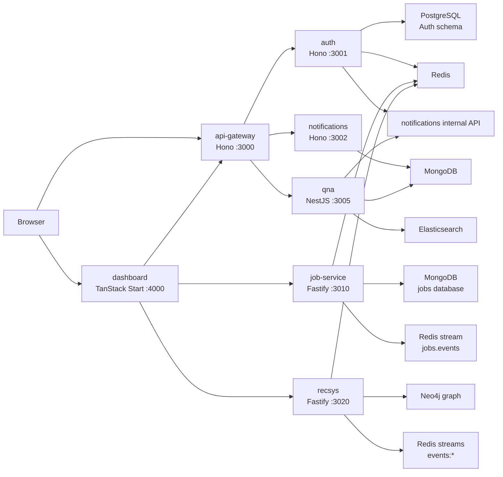
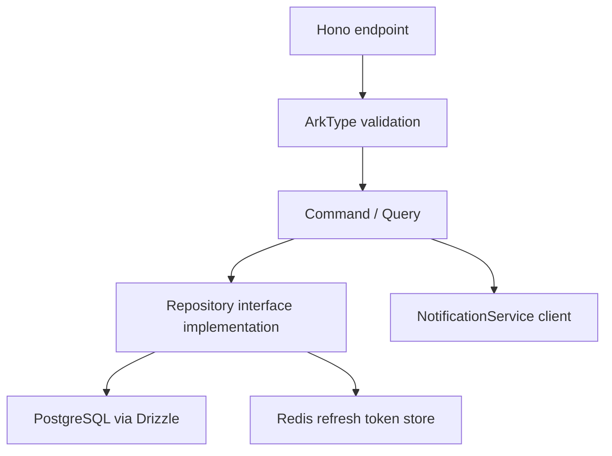
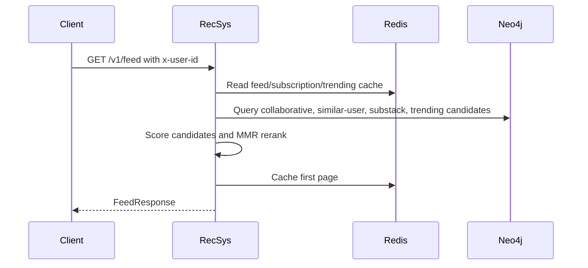
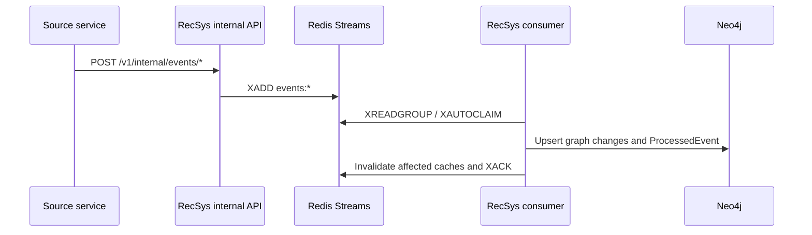
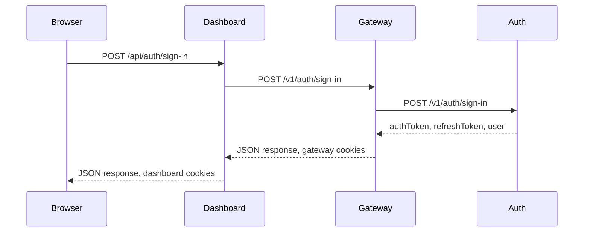
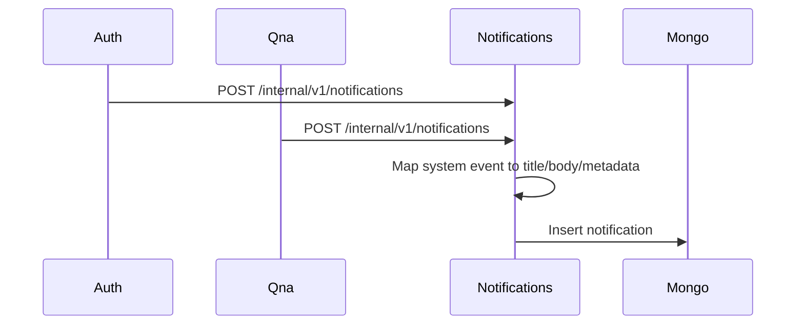
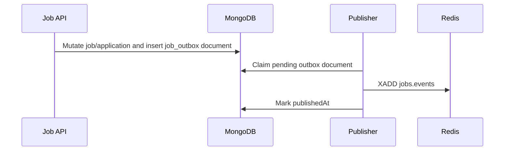

# Solvit Architecture

This document describes the architecture implemented in this repository as of
the current source review. It focuses on component ownership, service
boundaries, storage, API surfaces, and integration risks.

## System Overview

Solvit is a TypeScript monorepo managed by pnpm workspaces and Turborepo. The
backend is a service-oriented system with multiple API frameworks:

- Hono for the API gateway, Auth service, and Notifications service.
- Fastify for the Job service and Recommendation service.
- NestJS for the Q&A service.
- TanStack Start/Vite for the Dashboard frontend.



## Component Inventory

| Component | Path | Runtime | Primary dependencies | Responsibility |
| --- | --- | --- | --- | --- |
| API Gateway | `workspaces/api-gateway` | Hono | Auth, Notifications, Q&A | Public gateway for auth, notifications, substacks, and Q&A topics/comments |
| Auth | `workspaces/auth` | Hono | PostgreSQL, Redis, Notifications | Identity, JWTs, user follows, substacks |
| Notifications | `workspaces/notifications` | Hono | MongoDB | Notification storage and internal notification creation |
| Q&A | `workspaces/qna` | NestJS | MongoDB, Elasticsearch, Notifications | Topics, comments, votes, topic subscriptions, search |
| Job Service | `workspaces/job-service` | Fastify | MongoDB, Redis | Jobs, applications, job/application outbox events |
| RecSys | `workspaces/recsys` | Fastify | Neo4j, Redis, BullMQ | Personalized feed, similar topics/users, graph ingestion |
| Dashboard | `workspaces/dashboard` | TanStack Start | API Gateway, Job Service, RecSys, Better Auth wrapper | Frontend shell plus auth, substack, Q&A, notification, job, and recommendation proxy routes |

Shared packages:

- `packages/@domain/core`: command/query interfaces and base entity schemas.
- `packages/@domain/auth`: auth/user/substack schemas, entities, repository interfaces, and error constants.
- `packages/@domain/notification`: notification schemas, entity, and repository interface.
- `packages/@node/hono`: shared Hono middleware for IoC, Drizzle/Mongoose context, internal auth, and logging.
- `packages/@node/drizzle`: shared Drizzle id/timestamp schema helpers.
- `packages/@node/utils`: shared utility functions.
- `@types/globals`: global TypeScript declarations.

## Tool-Assisted API Report

The API report is generated before this architecture summary:

- `API_INVENTORY.md`: full static inventory of REST/server routes and exported
  function/class APIs.
- `API_REPORT.md`: readable report summarizing the route inventory, callable
  API families, and architecture conclusions.

The committed generator is `scripts/generate-api-docs.mjs` and can be run with
`pnpm docs:api`.

Generated API surface counts:

| Component | REST/server routes | Exported function/class APIs |
| --- | ---: | ---: |
| API Gateway | 35 | 37 |
| Auth Service | 18 | 136 |
| Dashboard | 33 | 100 |
| Job Service | 12 | 44 |
| Notifications Service | 5 | 39 |
| Q&A Service | 17 | 130 |
| Recommendation Service | 19 | 81 |
| Shared domain/node packages | 0 | 79 |

Architecture conclusions from the generated report:

1. The current generated surface is 139 REST/server routes and 646 exported
   callable/class APIs.
2. API Gateway now fronts Auth, Notifications, public Substacks, and Q&A
   topic/comment routes.
3. Auth remains the owner of users, follows, substacks, and token lifecycle;
   recent frontend auth work moved more browser workflows through Dashboard and
   Gateway.
4. Dashboard now includes auth, substack, topic/comment, notification, job, and
   recommendation server proxy routes.
5. Q&A is integrated through Gateway for topics/comments, but it still owns its
   NestJS controllers, MongoDB models, and Elasticsearch indexing.
6. RecSys remains a standalone recommendation service with internal event
   ingestion; Dashboard proxies browser-facing recommendation routes directly.
7. Shared packages expose domain schemas/entities/repository contracts, but
   cross-service runtime contracts such as JWT subject, current user
   propagation, and event envelopes still need one canonical definition.

Static report limitations:

- It does not prove runtime reachability or middleware behavior.
- It does not replace generated OpenAPI/Swagger schemas for request and
  response bodies.
- Hono mount prefixes are resolved from the current endpoint index files, so
  future dynamic mount logic would need a refreshed extraction pass.

## API Gateway

Path: `workspaces/api-gateway`

The gateway registers IoC services, logs requests, applies auth middleware to
all non-public routes, then mounts route groups.

Main routes:

- `GET /health`
- `POST /v1/auth/sign-up`
- `POST /v1/auth/sign-in`
- `POST /v1/auth/refresh`
- `POST /v1/auth/sign-out`
- `GET /v1/auth/profile`
- `POST /v1/auth/users/:userId/subscribe`
- `DELETE /v1/auth/users/:userId/subscribe`
- `GET /v1/notifications`
- `GET /v1/substacks`
- `GET /v1/substacks/:slug`
- `GET /v1/substacks/total`
- `GET /v1/topics/search`
- `POST /v1/topics`
- `GET /v1/topics/:id`
- `PATCH /v1/topics/:id`
- `DELETE /v1/topics/:id`
- `PATCH /v1/topics/:id/solve`
- `GET /v1/topics/:id/comments`
- `POST /v1/topics/:id/vote`
- `DELETE /v1/topics/:id/vote`
- `POST /v1/topics/:id/subscribe`
- `POST /v1/topics/:id/unsubscribe`
- `POST /v1/comments`
- `PATCH /v1/comments/:id`
- `DELETE /v1/comments/:id`
- `PATCH /v1/comments/:id/accept`
- `POST /v1/comments/:id/vote`

Important files:

- `src/adapters/restful/hono/index.ts`
- `src/adapters/restful/hono/middlewares/authMiddleware.ts`
- `src/adapters/restful/hono/endpoints/portal/auth.ts`
- `src/adapters/restful/hono/endpoints/portal/notifications.ts`
- `src/adapters/restful/hono/endpoints/portal/substacks.ts`
- `src/adapters/restful/hono/endpoints/portal/topics.ts`
- `src/adapters/restful/hono/endpoints/portal/comments.ts`
- `src/services/AuthService.ts`
- `src/services/NotificationService.ts`
- `src/services/QnaService.ts`

Current behavior:

- Public routes are `/health`, `/v1/auth/sign-in`, `/v1/auth/sign-up`,
  `/v1/auth/refresh`, `/v1/substacks`, `/v1/substacks/total`, and
  `GET /v1/substacks/:slug`.
- Protected routes validate a bearer token or `solvit_authToken` cookie by calling Auth `/v1/auth/profile`.
- Auth sign-in/sign-up/refresh responses are parsed so the gateway can set HTTP-only `solvit_authToken` and `solvit_refreshToken` cookies.
- Notifications are proxied to the Notifications service with the resolved
  authenticated user id injected into the upstream query string.
- Substack list and total-count routes are proxied to Auth without requiring a
  gateway-authenticated user.
- Q&A topic/comment routes are proxied to Q&A with the resolved current user id
  in the `x-user-id` header.

## Auth Service

Path: `workspaces/auth`

The Auth service uses Hono endpoints, ArkType validation, command/query use
cases, Drizzle repositories, and Redis refresh-token storage.

Main routes:

- `GET /health`
- `POST /v1/auth/sign-up`
- `POST /v1/auth/sign-in`
- `POST /v1/auth/refresh`
- `POST /v1/auth/sign-out`
- `GET /v1/auth/profile`
- `POST /v1/auth/users/:userId/subscribe`
- `DELETE /v1/auth/users/:userId/subscribe`
- `GET /v1/substacks`
- `GET /v1/substacks/total`
- `GET /v1/substacks/:slug`
- `POST /v1/substacks`
- `POST /v1/substacks/:slug/subscribe`
- `DELETE /v1/substacks/:slug/subscribe`
- `POST /admin/substacks/:slug/approve`

Primary storage:

- PostgreSQL tables: `roles`, `users`, `users_subscriptions`, `substacks`,
  `substack_roles`, `substack_role_assignments`, `substacks_subscriptions`.
- Redis keys: `refresh_token:<token>` for refresh-token allow-list entries.

Important files:

- `src/adapters/restful/hono/index.ts`
- `src/modules/auth/adapters/restful/hono/endpoints/portal/auth.ts`
- `src/modules/auth/application/portal/v1/commands/*`
- `src/modules/substack/application/**`
- `src/infrastructure/drizzle/schemas/*`
- `src/modules/auth/infrastructure/redis/repositories/AllowedTokenRepository.ts`

Layering:



## Notifications Service

Path: `workspaces/notifications`

Notifications is a Hono service backed by MongoDB through Mongoose. It exposes
portal routes for listing and marking notifications plus internal routes for
trusted services to create notifications.

Main routes:

- `GET /health`
- `GET /v1/notifications?userId=...&read=...&limit=...`
- `PATCH /v1/notifications/:id/read?userId=...`
- `POST /internal/v1/notifications`
- `POST /internal/v1/notifications/batch`

Internal routes require `x-internal-service-secret`.

Primary storage:

- MongoDB collection: `notifications`
- Indexed by `{ userId, read, createdAt }`

Important files:

- `src/adapters/restful/hono/index.ts`
- `src/modules/notification/adapters/restful/hono/endpoints/portal/notifications.ts`
- `src/modules/notification/adapters/restful/hono/endpoints/internal/notifications.ts`
- `src/modules/notification/domain/services/SystemNotificationService.ts`
- `src/infrastructure/mongoose/schemas/notifications.ts`

Supported system notification families:

- `auth.sign-up.welcome`
- `social.user.subscribed`
- `qna.topic.upvoted`
- `qna.topic.downvoted`
- `qna.answer.upvoted`
- `qna.answer.downvoted`
- `substack.topic.created`
- `substack.subscribed`
- `substack.approved`
- `substack.created`

## Q&A Service

Path: `workspaces/qna`

Q&A is a NestJS service with MongoDB persistence and Elasticsearch-based topic
search.

Main routes:

- `GET /`
- `POST /topics`
- `GET /topics/search`
- `GET /topics/:id`
- `GET /topics/:id/comments`
- `PATCH /topics/:id`
- `PATCH /topics/:id/solve`
- `DELETE /topics/:id`
- `POST /topics/:id/subscribe`
- `POST /topics/:id/unsubscribe`
- `POST /topics/:id/vote`
- `DELETE /topics/:id/vote`
- `POST /comments`
- `PATCH /comments/:id`
- `PATCH /comments/:id/accept`
- `DELETE /comments/:id`
- `POST /comments/:id/vote`

Primary storage:

- MongoDB collections for `topics`, `comments`, `votes`, and `topic_subscriptions`.
- Elasticsearch index `topics` for topic title/body search.

Important files:

- `src/main.ts`
- `src/app.module.ts`
- `src/database/mongo.module.ts`
- `src/search/search.module.ts`
- `src/search/search.service.ts`
- `src/topics/*`
- `src/comments/*`
- `src/votes/*`
- `src/topic_subscriptions/*`
- `src/notifications/notification.service.ts`

Search behavior:

- Topic create/update/delete writes to Elasticsearch.
- `GET /topics/search` queries Elasticsearch, then loads matching MongoDB topics by id.
- `substack_id` filters search results.

## Job Service

Path: `workspaces/job-service`

Job Service is a Fastify service with MongoDB as source of truth and Redis for
caching, rate limiting, idempotency caching, and outbox publishing.

Main routes:

- `GET /`
- `GET /health`
- `GET /v1/jobs`
- `GET /v1/jobs/:id`
- `POST /v1/jobs`
- `PATCH /v1/jobs/:id`
- `DELETE /v1/jobs/:id`
- `POST /v1/jobs/:id/applications`
- `GET /v1/jobs/:id/applications`
- `GET /v1/jobs/:id/me/application`
- `GET /v1/me/applications`
- `PATCH /v1/applications/:id/status`

Primary storage:

- MongoDB collections: `jobs`, `job_applications`, `job_outbox`,
  `idempotency_keys`.
- Redis cache keys for job reads and idempotent application submissions.
- Redis rate-limit keys for application submission throttling.
- Redis stream `jobs.events` for published outbox events.

Important files:

- `src/app.ts`
- `src/domain/jobs/*`
- `src/domain/applications/*`
- `src/db/migrations/*`
- `src/cache/*`
- `src/events/publisher.ts`

Data patterns:

- Listing uses keyset cursor pagination over `{createdAt, _id}`.
- Search uses MongoDB text index over `title`, `content`, and `location`.
- Mutations run in MongoDB transactions.
- Job/application changes insert a `job_outbox` event inside the same transaction.
- `publish-outbox` reads pending outbox documents and emits to Redis Stream `jobs.events`.

## Recommendation Service

Path: `workspaces/recsys`

RecSys is a Fastify service for feed and discovery recommendations. It stores
behavioral graph state in Neo4j and uses Redis for streams, caches, and BullMQ
queues.

Main public routes:

- `GET /`
- `GET /health`
- `GET /v1/health`
- `GET /metrics`
- `GET /internal/metrics`
- `GET /internal/health`
- `GET /internal/ready`
- `GET /v1/feed` with `x-user-id`
- `GET /v1/trending`
- `GET /v1/topics/:id/similar`
- `GET /v1/similar/topics/:id`
- `GET /v1/users/:id/suggested-substacks`
- `GET /v1/similar/users/:id`

Main internal routes:

- `POST /internal/reindex/user/:userId`
- `POST /v1/internal/events/vote`
- `POST /v1/internal/events/subscription`
- `POST /v1/internal/events/topic`
- `POST /v1/internal/events/comment`
- `POST /v1/internal/events/substack`

Internal routes require `x-internal-service-secret`.

Primary storage and infrastructure:

- Neo4j nodes: `User`, `Topic`, `Comment`, `Substack`, `ProcessedEvent`.
- Neo4j relationships: `VOTED`, `SUBSCRIBED`, `AUTHORED`, `IN_SUBSTACK`, `SIMILAR_TO`.
- Redis streams: `events:vote`, `events:subscription`, `events:topic`, `events:comment`, `events:substack`.
- Redis caches: personalized feed, trending feed, user subscriptions.
- BullMQ queue: `recsys.batch`.
- Prometheus metrics via `prom-client`.

Important files:

- `src/app.ts`
- `src/routes/recommendation.routes.ts`
- `src/routes/internal.routes.ts`
- `src/events/types.ts`
- `src/events/stream.ts`
- `src/events/ingest.ts`
- `src/recommendation/*`
- `src/jobs/*`
- `src/neo4j/*`

Recommendation flow:



Event ingestion flow:



Batch jobs:

- `refresh-popularity`: recalculates topic vote score and hotness.
- `refresh-similarity`: uses Neo4j GDS FastRP and KNN to write `SIMILAR_TO`.
- `prune-processed-events`: removes old processed-event markers.

## Dashboard

Path: `workspaces/dashboard`

The dashboard is a TanStack Start app on port `4000`. It includes auth UI,
server routes, a Better Auth wrapper, service console pages, and frontend
feature slices that proxy through Dashboard server routes.

Main UI routes:

- `/`
- `/about`
- `/jobs`
- `/notifications`
- `/recommendations`
- `/signal`
- `/signals`
- `/substacks`
- `/substacks/$slug`
- `/topics`
- `/sign-in`
- `/sign-up`

Server/API routes:

- `POST /api/auth/$`: Better Auth-compatible bridge for gateway sign-in,
  sign-up, and sign-out.
- `/api/portal/auth/profile`: direct server proxy to gateway `/v1/auth/profile`.
- `/api/portal/substacks/`: direct server proxy to gateway `/v1/substacks`.
- `/api/portal/substacks/$slug`: direct server proxy to gateway
  `/v1/substacks/:slug`.
- `/api/portal/substacks/$slug/subscribe`: direct server proxy to gateway
  `/v1/substacks/:slug/subscribe`.
- `/api/portal/substacks/total`: direct server proxy to gateway `/v1/substacks/total`.
- `/api/portal/topics/*`: direct server proxy to gateway `/v1/topics/*`.
- `/api/portal/comments/*`: direct server proxy to gateway `/v1/comments/*`.
- `/api/portal/notifications/*`: direct server proxy to gateway
  `/v1/notifications/*`.
- `/api/services/jobs/*`: direct server proxy to Job Service `/v1/jobs/*`.
- `/api/services/applications/*`: direct server proxy to Job Service
  `/v1/applications/*`.
- `/api/services/me/applications`: direct server proxy to Job Service
  `/v1/me/applications`.
- `/api/services/recommendations/*`: direct server proxy to RecSys `/v1/*`.

Important files:

- `src/router.tsx`
- `src/routes/__root.tsx`
- `src/routes/index.tsx`
- `src/routes/sign-in.tsx`
- `src/routes/sign-up.tsx`
- `src/routes/topics.tsx`
- `src/routes/jobs.tsx`
- `src/routes/notifications.tsx`
- `src/routes/recommendations.tsx`
- `src/routes/signal.tsx`
- `src/routes/signals.tsx`
- `src/routes/api/auth/$.ts`
- `src/routes/api/portal/auth/*`
- `src/routes/api/portal/substacks/*`
- `src/routes/api/portal/topics/*`
- `src/routes/api/portal/comments/*`
- `src/routes/api/portal/notifications/*`
- `src/routes/api/services/*`
- `src/routes/substacks/$slug/index.tsx`
- `src/features/auth/api/*`
- `src/features/auth/components/AuthForm.tsx`
- `src/features/auth/queries/authQueries.ts`
- `src/features/services/api/*`
- `src/features/services/components/*`
- `src/features/substack/api/*`
- `src/features/substack/components/SubstacksIsland.tsx`
- `src/features/substack/queries/*`

## Data Ownership

| Data | Owner | Store | Notes |
| --- | --- | --- | --- |
| Users, roles, user follows | Auth | PostgreSQL | User id source of truth for Hono services |
| Substacks, roles, subscriptions | Auth | PostgreSQL | Auth owns substack approval and membership |
| Notifications | Notifications | MongoDB | User-addressed notification documents |
| Topics, comments, votes | Q&A | MongoDB | Gateway-proxied calls carry the resolved user id as `x-user-id`; direct service calls still depend on caller-supplied user context |
| Topic search documents | Q&A | Elasticsearch | Derived from MongoDB topic lifecycle |
| Jobs, applications | Job Service | MongoDB | Logical user references use ObjectId hex strings |
| Job/application events | Job Service | MongoDB outbox, Redis stream | Publishes to `jobs.events` |
| Recommendation graph | RecSys | Neo4j | Derived behavioral/structural graph |
| Recommendation streams/caches | RecSys | Redis | Streams, feed cache, trending cache, BullMQ |

## Authentication And Authorization

Current auth boundaries:

- API Gateway validates protected requests by calling Auth `/v1/auth/profile`.
- Auth signs JWTs with `sub` set to the user's email.
- Auth refresh tokens are opaque random strings stored in Redis.
- Dashboard stores auth tokens in HTTP-only cookies through server-side proxy routes.
- Dashboard forwards authenticated browser requests to API Gateway and maps the
  auth cookie to bearer tokens for direct Job Service proxy calls.
- Dashboard injects the resolved current user id into RecSys `/v1/feed`
  requests.
- Job Service validates JWTs itself and expects `sub` to be a MongoDB ObjectId
  hex string.
- Q&A does not currently validate JWTs itself; gateway-proxied routes inject
  the resolved current user id as `x-user-id`, while direct service calls still
  depend on caller-supplied user context.
- Notifications portal routes accept `userId` query parameters; API Gateway
  injects that query value for browser-facing traffic.
- RecSys `/v1/feed` accepts `x-user-id` and expects a trusted caller to inject it.
- Internal Notifications and RecSys event routes use shared-secret headers.

## Integration Flows

### Dashboard Sign-in



### System Notifications



### Job Events



## Local Infrastructure

Root `docker-compose.yml` provides:

- PostgreSQL 16 on `5432`
- PgBouncer on `6432`
- Redis 7 on `6379`
- MongoDB 7 replica set on `27017`
- Mongo Express on `8081`
- Neo4j 5 on `7474` and `7687`
- RecSys container on `3020`

Q&A also has a workspace-level `docker-compose.yml` for Elasticsearch on
`9200`; this is separate from the root compose file.

Useful local commands:

```sh
docker compose up -d
pnpm --filter job-service migrate
pnpm --filter recsys migrate
pnpm --filter recsys consume-events
pnpm --filter recsys worker
pnpm dev
```

## Architecture Review Notes

These are the main architecture-affecting findings from the current source.

1. Auth sign-up still appears to double-hash passwords. `SignUpCommand` hashes
   the password, then `UserRepository.create` hashes the already-hashed value.
   New sign-ups may not be able to sign in.
2. Auth and Job Service still need one canonical JWT subject contract. Job
   Service currently requires `sub` to be a MongoDB ObjectId hex string.
3. Notifications portal routes trust `userId` query parameters. If the service
   is reachable directly, a caller can request or mutate another user's
   notifications.
4. Q&A has no service-local authentication middleware. Gateway-proxied calls
   inject the resolved user id, but direct Q&A access still trusts
   caller-supplied `x-user-id` for ownership, voting, subscriptions, and
   deletes.
5. Q&A still contains a hard-coded MongoDB Atlas URI with credentials in source.
6. Q&A Elasticsearch config is hard-coded to `http://localhost:9200` and its
   compose file is separate from the root compose stack.
7. Q&A topic search depends on the Elasticsearch `topics` index. If the index
   has not been created or seeded, `/topics/search` can return an upstream
   `index_not_found_exception`.
8. Notifications environment typing declares `MONGO_URI`, but runtime code reads
   `MONGODB_URI`.
9. RecSys is implemented but not integrated with source services in this repo.
   Auth/Q&A do not push RecSys events, and API Gateway does not proxy RecSys
   routes.
10. RecSys `/v1/feed` trusts direct `x-user-id` input. It should only be exposed
    behind a trusted gateway or should validate tokens directly.
11. Job Service publishes `jobs.events`, while RecSys consumes `events:*`
    streams. There is no bridge or consumer connecting those event models.
12. Q&A search writes to Elasticsearch synchronously after MongoDB writes. A
    search indexing failure can fail the user-facing topic create/update/delete
    path unless handled intentionally.

## Recommended Architecture Decisions

Before expanding features further, decide:

1. The canonical user id shape across Auth, Q&A, Job Service, Notifications, and RecSys.
2. Whether all browser-facing APIs must go through API Gateway.
3. Whether internal services should use shared-secret headers, signed service JWTs, or mTLS.
4. Whether Q&A, Notifications, and RecSys should derive the current user from a token instead of request fields.
5. Whether RecSys should consume source events directly from each source service or through a central event bus contract.
6. Whether Elasticsearch indexing should be synchronous, best-effort, or outbox-driven.
