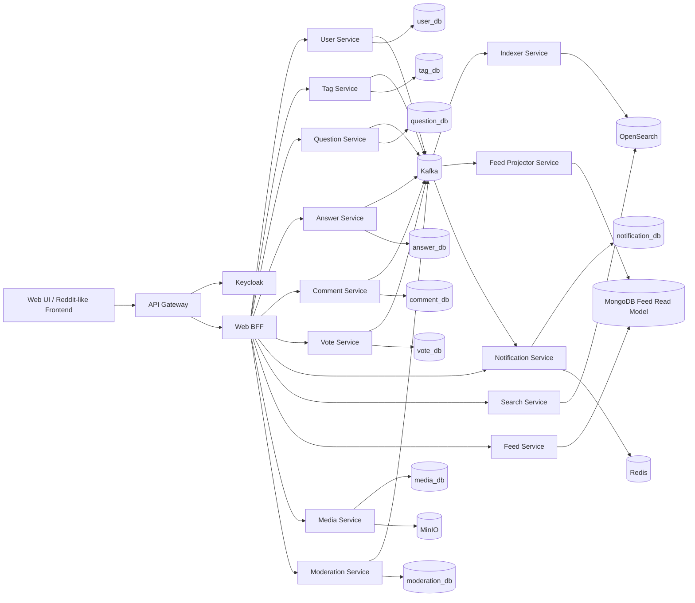

# DevQ&A / StackIt - Microservices-First HLD

## 1. Overview

This document describes a **microservices-first high-level design** for a mini technical Q&A platform with **Reddit-like browsing** and **Stack Overflow-like knowledge mechanics**.

Core product goals:

- Ask and answer technical questions
- Vote on questions and answers
- Mark one answer as accepted
- Search by keywords, tags, and relevance
- Follow questions/tags/users and receive notifications
- Generate a personalized feed based on followed tags, watched questions, and relevant activity

This HLD is intentionally written as a **real-world target architecture**, not a classroom CRUD-only sketch.

---

## 2. Architecture Principles

1. **Microservices first**
   - Split by business capability, not by controller/package.
   - Each service owns its data and exposes APIs/events.

2. **Database per service**
   - No direct cross-service table access.
   - Cross-service reads happen via APIs, events, or read models.

3. **Event-driven integration**
   - Core business state changes publish domain events to Kafka.
   - Downstream services build projections asynchronously.

4. **Polyglot persistence**
   - Use the best storage technology for each workload.

5. **Search is a dedicated concern**
   - Full-text and relevance ranking are handled by OpenSearch.
   - Transactional writes stay in service-owned databases.

6. **Read-optimized feed**
   - Personalized/home feed is treated as a read-model problem, not a synchronous SQL join problem.

7. **Stateless application services**
   - Horizontal scaling via containers.
   - Externalize session/state/caching.

8. **Observability by design**
   - Traces, metrics, logs, dashboards, and correlation IDs included from day one.

---

## 3. Functional Scope

### MVP

- Authentication and login
- User profile
- Ask question
- Answer question
- Comment on question/answer
- Upvote/downvote
- Accept answer / resolved state
- Tags
- Search
- Follow question
- Notifications

### Phase 2

- Follow tags
- Follow users
- Personalized feed
- Moderation basics (report, close/reopen)
- Attachments/media

### Explicitly out of scope

- Job board
- Candidate recommendation
- Resume matching
- Full social timeline/profile posts
- Realtime chat

---

## 4. Service Landscape

### 4.1 Edge Layer

#### API Gateway

Responsibilities:

- Single public entry point
- Route requests to internal services
- JWT validation / token relay
- Rate limiting
- Request ID propagation
- CORS / edge policies

Suggested tech:

- Kong / Spring Cloud Gateway / NGINX-based API gateway

#### Web BFF (optional)

Responsibilities:

- Backend-for-frontend tailored to the web UI
- Aggregate small reads for the UI
- Hide internal topology from frontend

---

### 4.2 Identity / Access Layer

#### Identity Service (Keycloak)

Responsibilities:

- Authentication
- OAuth2/OIDC token issuance
- Roles: user, moderator, admin
- Password reset / email verification (future)

Why separate:

- Authentication is infrastructure-heavy and benefits from a dedicated identity provider.

Storage:

- PostgreSQL (Keycloak-owned)

---

### 4.3 Core Domain Services

#### User Service

Responsibilities:

- User profile metadata
  n- Reputation summary (optional)
- Public profile read API
- Follow user relations (if enabled)

Owned data:

- users
- profiles
- user_followers

Primary DB:

- PostgreSQL (`user_db`)

#### Tag Service

Responsibilities:

- Tag catalog
- Tag metadata and aliases
- Tag follow/subscription
- Tag validation and moderation rules

Owned data:

- tags
- tag_aliases
- user_tag_subscriptions

Primary DB:

- PostgreSQL (`tag_db`)

#### Question Service

Responsibilities:

- Create/update/delete questions
- Question lifecycle: open, closed, deleted
- Link question to tags
- Watch/follow question
- Emit question lifecycle events

Owned data:

- questions
- question_tags
- question_watchers

Primary DB:

- PostgreSQL (`question_db`)

#### Answer Service

Responsibilities:

- Create/update/delete answers
- Mark accepted answer
- Maintain answer state
- Emit answer lifecycle events

Owned data:

- answers
- accepted_answer_audit

Primary DB:

- PostgreSQL (`answer_db`)

#### Comment Service

Responsibilities:

- Comments for questions and answers
- Basic thread depth control
- Soft-delete/edit history

Owned data:

- comments

Primary DB:

- PostgreSQL (`comment_db`)

#### Vote Service

Responsibilities:

- Upvote/downvote question
- Upvote/downvote answer
- Idempotent vote transitions
- Emit vote-changed events

Owned data:

- votes
- vote_counters_cache_table (optional)

Primary DB:

- PostgreSQL (`vote_db`)

#### Notification Service

Responsibilities:

- Persist notifications
- Consume business events from Kafka
- Fan out websocket/SSE updates
- Read/unread state

Owned data:

- notifications
- notification_delivery_log

Primary DB:

- PostgreSQL (`notification_db`)

Infra helpers:

- Redis for ephemeral fanout / online-user mapping

#### Search Service

Responsibilities:

- Query OpenSearch
- Expose search API for questions/tags/users
- Manage query parsing, weighting, typo tolerance, highlights

Owned data:

- No source-of-truth business tables
- Search index documents in OpenSearch

Storage:

- OpenSearch indices

#### Indexer Service

Responsibilities:

- Consume Kafka events
- Build/update OpenSearch documents
- Handle reindex jobs
- Denormalize title/body/tags/author/score/answer count/accepted state

Storage:

- OpenSearch
- Optional dead-letter topic

#### Feed Service

Responsibilities:

- Build home feed / topic feed / watched-content feed
- Read from denormalized read model
- Rank by freshness + relevance + follow signals

Read model:

- MongoDB (`feed_read_db`)

Why MongoDB here:

- Flexible, denormalized feed documents
- Good fit for read patterns that bundle question summary, author, tags, counters, accepted state, and personalization hints

#### Feed Projector Service

Responsibilities:

- Consume Kafka events
- Build/update feed documents in MongoDB
- Maintain topic timelines and user-personalized feed materialization

Storage:

- MongoDB

#### Media Service (optional in phase 2)

Responsibilities:

- Upload attachments/images
- Metadata + signed URLs
- Virus-scan hook (future)

Owned data:

- media_metadata

Storage:

- PostgreSQL (`media_db`) for metadata
- MinIO for object storage

#### Moderation Service (phase 2)

Responsibilities:

- Reports
- Close/reopen workflows
- Moderator audit trail

Owned data:

- reports
- moderation_actions

Primary DB:

- PostgreSQL (`moderation_db`)

---

## 5. Why These Storage Choices

### PostgreSQL for transactional services

Use PostgreSQL for:

- User
- Tag
- Question
- Answer
- Comment
- Vote
- Notification
- Moderation
- Media metadata

Why:

- Strong transactional integrity
- Mature relational modeling
- Good fit for questions, answers, votes, follow relations, audit data

### OpenSearch for search

Use OpenSearch for:

- Full-text question search
- Relevance ranking
- Fuzzy matching / analyzers / stemming
- Highlighting
- Aggregations on tags and filters

Why not only PostgreSQL search:

- PostgreSQL full-text search is good, but a real product-grade search stack benefits from a dedicated search engine when ranking, analyzers, typo tolerance, and query tuning become first-class features.

### MongoDB for feed/read projections

Use MongoDB for:

- Prejoined feed cards
- Topic timelines
- User-personalized feed documents

Why:

- Feed read models are denormalized by nature
- Data accessed together should be stored together
- Flexible schema helps evolve ranking metadata and projection shape without painful relational redesign

### Redis for ephemeral performance concerns

Use Redis for:

- Cache hot reads
- Rate limit counters
- Notification online-session registry
- Short-lived feed cache
- Idempotency keys / distributed locks when needed

Do **not** use Redis as source of truth for votes/questions/answers.

### Kafka for asynchronous integration

Use Kafka for:

- Domain event backbone
- Search indexing pipeline
- Feed projection pipeline
- Notification triggers
- Audit/event replay potential

### MinIO for object storage

Use MinIO for:

- S3-compatible file/object storage in local/dev/self-hosted environments

---

## 6. Database Per Service Model

Each service owns its own database/schema/credentials.

For a practical class project, the clean compromise is:

- one PostgreSQL server/container
- multiple logical databases
- separate DB users per service
- no cross-service table access

Example logical separation:

- `user_db`
- `tag_db`
- `question_db`
- `answer_db`
- `comment_db`
- `vote_db`
- `notification_db`
- `moderation_db`
- `media_db`
- `keycloak_db`

This still respects **database-per-service** because ownership and credentials remain isolated.

---

## 7. High-Level Context Diagram



---

## 8. Key Domain Events

Suggested Kafka topics:

- `user.profile.updated`
- `tag.created`
- `tag.followed`
- `question.created`
- `question.updated`
- `question.deleted`
- `question.watched`
- `question.closed`
- `answer.created`
- `answer.updated`
- `answer.accepted`
- `comment.created`
- `vote.changed`
- `user.followed`
- `notification.requested`
- `media.uploaded`
- `moderation.action.created`

Event payload convention:

- `eventId`
- `eventType`
- `occurredAt`
- `producer`
- `aggregateType`
- `aggregateId`
- `actorUserId`
- `payload`
- `correlationId`

---

## 9. Core Request Flows

### 9.1 Ask Question

1. UI sends create-question request to API Gateway.
2. Gateway validates JWT via Keycloak.
3. Request goes to Question Service.
4. Question Service stores question in `question_db`.
5. Question Service emits `question.created`.
6. Indexer Service updates OpenSearch document.
7. Feed Projector updates topic and global feed documents.
8. Notification Service may notify followers of related tags later.

### 9.2 Answer Question

1. UI submits answer.
2. Answer Service validates referenced question via Question Service API or cached validation.
3. Answer stored in `answer_db`.
4. Event `answer.created` published.
5. Search index updated.
6. Feed projection updated.
7. Notification created for question owner and watchers.

### 9.3 Vote on Answer

1. Vote request goes to Vote Service.
2. Vote Service enforces one-vote-per-user-per-target.
3. Vote persisted in `vote_db`.
4. Vote delta emitted as `vote.changed`.
5. Search index and feed projection update counters asynchronously.

### 9.4 Accept Answer

1. Question owner triggers accept-answer.
2. Answer Service verifies ownership/authorization.
3. Accepted answer state written in `answer_db`.
4. Event `answer.accepted` published.
5. Question summary projections updated.
6. Notification sent to answer author.

### 9.5 Search

1. UI sends search request.
2. Search Service queries OpenSearch.
3. Results returned with highlight snippets, filters, and ranking metadata.

### 9.6 Home Feed

1. UI requests home feed.
2. Feed Service reads precomputed documents from MongoDB.
3. Optional Redis cache returns hot personalized feed pages.
4. Response includes aggregated card shape ready for UI.

### 9.7 Notifications

1. Domain event lands on Kafka.
2. Notification Service decides recipient set and notification type.
3. Notification stored in `notification_db`.
4. If recipient is online, push via websocket/SSE using Redis-backed connection registry.

---

## 10. Suggested Feed Strategy

Do **not** build a complex ML recommender in this project.

Use a deterministic ranking formula first:

`feed_score = freshness_weight + tag_follow_weight + watched_question_weight + vote_weight + answer_activity_weight + accepted_answer_bonus`

Feed views:

- Home: followed tags + watched questions + trending technical content
- Tag feed: newest + top within a tag
- User activity feed: optional later

MongoDB document example shape:

```json
{
  "feedItemId": "question:123",
  "questionId": 123,
  "title": "How to optimize Redis Streams consumer groups?",
  "excerpt": "...",
  "author": {
    "userId": 7,
    "displayName": "alice"
  },
  "tags": ["redis", "kafka", "backend"],
  "counters": {
    "upvotes": 15,
    "answers": 3,
    "comments": 2
  },
  "accepted": true,
  "rankSignals": {
    "hotScore": 18.2,
    "freshnessBucket": "6h",
    "followedTagMatch": true
  },
  "createdAt": "2026-04-17T10:00:00Z",
  "updatedAt": "2026-04-17T11:15:00Z"
}
```

---

## 11. Search Design

### Search document content

Index question-centric documents including:

- question title
- question body
- tags
- author display name
- answer count
- score
- accepted flag
- latest activity timestamp

### Search capabilities

- keyword search
- tag filters
- accepted/unanswered filters
- sort by relevance/newest/top
- highlights
- stemming/analyzers
- typo tolerance/fuzziness

### Search write path

- Services publish events
- Indexer consumes and builds denormalized search documents
- Search index is eventually consistent with source-of-truth databases

---

## 12. Consistency Model

This system is **not** globally ACID across services.

Use:

- local ACID transactions inside each service DB
- Kafka events for downstream synchronization
- eventual consistency for feed/search/notifications

When a workflow touches multiple services, use **Saga-style orchestration/choreography** rather than distributed XA transactions.

Examples:

- create answer -> notify watchers
- accept answer -> update search and feed -> notify author
- close question -> remove answer action eligibility in downstream projections

---

## 13. Security Design

### Identity and access

- Keycloak issues OIDC/OAuth2 tokens
- Gateway verifies token
- Internal services trust JWT claims or token introspection pattern

### Roles

- `user`
- `moderator`
- `admin`

### API security

- TLS at edge
- Per-service authorization checks
- Rate limiting at gateway
- Request size limits
- Input validation and sanitization

### Data security

- MinIO buckets private by default
- Signed URLs for downloads/uploads
- Secrets via `.env`/Docker secrets in dev and secret manager in real deployment

---

## 14. Observability Design

Use:

- OpenTelemetry for traces/metrics/log correlation
- Prometheus for metrics scraping
- Grafana for dashboards
- Jaeger or Tempo for distributed tracing

Standard telemetry fields:

- `traceId`
- `spanId`
- `correlationId`
- `userId` (when safe)
- `service.name`
- `eventType`

Key dashboards:

- API latency by service/endpoint
- Kafka consumer lag
- OpenSearch query latency
- feed projector delay
- notification delivery failures
- database connection pool saturation
- cache hit ratio

---

## 15. Deployment View

### Local / student-team environment

Use Docker Compose for:

- local integration
- service-to-service connectivity
- named volumes
- one-command environment startup

### Production-style evolution path

For real production beyond class scope:

- Kubernetes
- managed Kafka/OpenSearch/PostgreSQL/MongoDB
- service mesh optional
- autoscaling
- CI/CD

---

## 16. Docker Topology (Design View)

Containers/services in compose:

- `api-gateway`
- `web-bff`
- `keycloak`
- `postgres-core`
- `mongo-feed`
- `redis`
- `kafka`
- `zookeeper` or KRaft-based Kafka setup
- `opensearch`
- `opensearch-dashboards`
- `minio`
- `user-service`
- `tag-service`
- `question-service`
- `answer-service`
- `comment-service`
- `vote-service`
- `notification-service`
- `search-service`
- `indexer-service`
- `feed-service`
- `feed-projector-service`
- `media-service`
- `moderation-service`
- `otel-collector`
- `prometheus`
- `grafana`
- `jaeger`

Networks:

- `edge-net`
- `app-net`
- `data-net`
- `observability-net`

Persistent volumes:

- postgres
- mongo
- redis
- kafka
- opensearch
- minio
- prometheus
- grafana

---

## 17. Service-to-DB Ownership Matrix

| Service              | DB / Store                             | Purpose                                 |
| -------------------- | -------------------------------------- | --------------------------------------- |
| Keycloak             | PostgreSQL (`keycloak_db`)             | identity and auth                       |
| User Service         | PostgreSQL (`user_db`)                 | user/profile/follow-user                |
| Tag Service          | PostgreSQL (`tag_db`)                  | tag catalog + subscriptions             |
| Question Service     | PostgreSQL (`question_db`)             | questions + watchers                    |
| Answer Service       | PostgreSQL (`answer_db`)               | answers + accepted state                |
| Comment Service      | PostgreSQL (`comment_db`)              | comments                                |
| Vote Service         | PostgreSQL (`vote_db`)                 | votes                                   |
| Notification Service | PostgreSQL (`notification_db`) + Redis | durable notifications + realtime fanout |
| Search Service       | OpenSearch                             | search query/index access               |
| Indexer Service      | OpenSearch                             | write projection into search index      |
| Feed Service         | MongoDB (`feed_read_db`) + Redis       | personalized read model + caching       |
| Feed Projector       | MongoDB (`feed_read_db`)               | feed projections                        |
| Media Service        | PostgreSQL (`media_db`) + MinIO        | metadata + files                        |
| Moderation Service   | PostgreSQL (`moderation_db`)           | reports and actions                     |

---

## 18. Recommended Team Implementation Strategy

Even though the **architecture target is microservices-first**, the implementation must still be staged to reduce delivery risk.

### Sprint 1

- Keycloak
- API Gateway
- User Service
- Tag Service
- Question Service
- Answer Service
- PostgreSQL setup with separate logical DBs

### Sprint 2

- Comment Service
- Vote Service
- Notification Service
- Redis
- Kafka basic domain events

### Sprint 3

- Search Service
- Indexer Service
- OpenSearch
- Feed Projector
- Feed Service
- MongoDB

### Sprint 4

- Moderation Service
- Media Service
- Observability stack
- Hardening and demo scenario

This preserves the microservices architecture while still giving the team a realistic delivery path.

---

## 19. Risks and Tradeoffs

### Benefits of this design

- Clean service boundaries
- Realistic microservices HLD
- Proper search architecture
- Scalable read models for feed/search
- Good demo story for backend/system design discussion

### Costs of this design

- More operational complexity
- More infra to run locally
- Eventual consistency must be explained clearly in defense
- Harder testing than monolith

### Main architectural tradeoff

You are choosing **better system design realism** over **implementation simplicity**.

For a master's/backend course, that tradeoff is valid **if** the team clearly communicates:

- what is HLD target architecture
- what is MVP delivery cutline
- where eventual consistency is acceptable

---

## 20. Recommended Defense Positioning

Use this sentence in presentations:

> We intentionally designed the platform as a microservices-first, event-driven system with database-per-service, dedicated search, and denormalized feed read models so that the architecture reflects a production-grade knowledge platform rather than a simple CRUD forum.

And this sentence for scope discipline:

> Although the target architecture is microservices-based, the feature scope is deliberately constrained to Q&A, voting, accepted answers, search, following, feed, and notifications, while jobs and broader social networking features are excluded to keep the system coherent.

---

## 21. Deliverables to Show in Demo / Report

1. Service boundary diagram
2. Database ownership matrix
3. Kafka event catalog
4. OpenSearch index document shape
5. MongoDB feed document shape
6. Docker Compose deployment view
7. 2-3 end-to-end sequences:
   - create question
   - answer + notify
   - accept answer + projection updates
8. tradeoff discussion:
   - why PostgreSQL for OLTP
   - why OpenSearch for search
   - why MongoDB for feed read model
   - why Redis only for cache/ephemeral usage
   - why Kafka for async integration

---

## 22. Final Recommendation

**Yes: microservices first.**

The cleanest final architecture for your topic is:

- **microservices by business capability**
- **PostgreSQL for transactional ownership**
- **OpenSearch for search**
- **MongoDB for feed/read projections**
- **Redis for cache/realtime helpers**
- **Kafka for domain events**
- **Keycloak for identity**
- **MinIO for object storage**
- **Docker Compose for local topology**

That is the version that looks like a real HLD instead of a classroom monolith.
