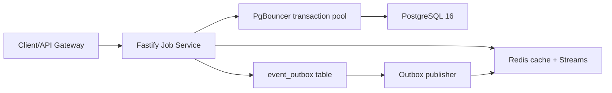

# Job Service Benchmark Results

## Architecture

## DDL And Index Decisions

| Area | Choice | Reason |
|---|---|---|
| Primary keys | BIGINT identity | Smaller B-tree indexes and sequential inserts |
| Cross-service users | Logical FK only | Keeps User service decoupled |
| Job status | PostgreSQL ENUM | Compact and type-safe for prototype scope |
| Job list pagination | Keyset `(created_at, id)` | Avoids deep OFFSET scans |
| Full-text search | Generated `tsvector` + GIN | Fast search without trigger maintenance |
| JSONB metadata | PostgreSQL JSONB | Keeps metadata transactional with row data |
| Hot reads | Redis cache-aside | Protects DB for job detail and applied checks |

Note: the prototype migration uses PostgreSQL `simple` text search config. If Vietnamese stemming/diacritics become a primary search requirement, add `unaccent` and benchmark the changed `search_vector`.

## Latency Table

| Scenario | Dataset | p50 | p95 | p99 | Notes |
|---|---:|---:|---:|---:|---|
| `GET /v1/jobs` | TBD | TBD | TBD | TBD | keyset + covering index |
| `GET /v1/jobs/:id` cache miss | TBD | TBD | TBD | TBD | PK lookup |
| `GET /v1/jobs/:id` cache hit | TBD | TBD | TBD | TBD | Redis |
| `POST /v1/jobs/:id/applications` | TBD | TBD | TBD | TBD | transaction + outbox |

## EXPLAIN Snippets

Paste `EXPLAIN (ANALYZE, BUFFERS)` output for the slowest query before and after each index or query rewrite.

## Iteration Log

| Iteration | Observation | Action | Result |
|---|---|---|---|
| 1 | TBD | TBD | TBD |

## Next Steps

- Add BRIN on `job_applications.created_at` after the table reaches several million rows and report workloads need time-range scans.
- Add monthly range partitioning for `job_applications` when archival becomes a regular operation.
- Introduce read replicas only after `pg_stat_statements` shows read saturation on primary.
