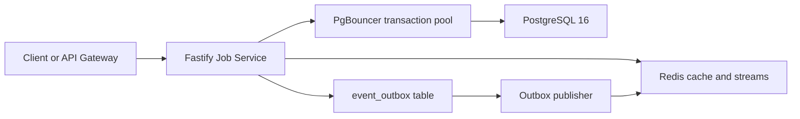

# Job Service Benchmark Results

Use this template for repeatable Job Service performance runs. Capture the
dataset size, schema/index decisions, latency results, and query plans for each
iteration.

## Architecture

```mermaid
flowchart LR
  Client["Client or API Gateway"] --> JobService["Fastify Job Service"]
  JobService --> PgBouncer["PgBouncer transaction pool"]
  PgBouncer --> Postgres["PostgreSQL 16"]
  JobService --> Redis["Redis cache and streams"]
  JobService --> Outbox["event_outbox table"]
  Outbox --> Publisher["Outbox publisher"]
  Publisher --> Redis
```

## Run Context

| Field | Value |
| --- | --- |
| Date | TBD |
| Git commit | TBD |
| Machine | TBD |
| Node version | TBD |
| PostgreSQL settings | TBD |
| Redis settings | TBD |
| Seed command | TBD |

## Dataset

| Entity | Count | Notes |
| --- | ---: | --- |
| Jobs | TBD | Seeded open/closed job mix |
| Applications | TBD | Distribution per job TBD |
| Event outbox rows | TBD | Sent/unsent split TBD |

## Schema And Index Decisions

| Area | Choice | Reason |
| --- | --- | --- |
| Primary keys | BIGINT identity | Smaller B-tree indexes and sequential inserts |
| Cross-service users | Logical FK only | Keeps Auth service decoupled |
| Job status | PostgreSQL enum | Compact state representation |
| Job list pagination | Keyset `(created_at, id)` | Avoids deep offset scans |
| Full-text search | Generated `tsvector` plus GIN | Fast search without trigger maintenance |
| JSON metadata | PostgreSQL JSONB | Keeps flexible metadata transactional |
| Hot reads | Redis cache-aside | Protects database for repeated detail reads |

## Latency Results

| Scenario | Dataset | p50 | p95 | p99 | Notes |
| --- | ---: | ---: | ---: | ---: | --- |
| `GET /v1/jobs` | TBD | TBD | TBD | TBD | Keyset list |
| `GET /v1/jobs?q=...` | TBD | TBD | TBD | TBD | Full-text search |
| `GET /v1/jobs/:id` cache miss | TBD | TBD | TBD | TBD | Primary key lookup |
| `GET /v1/jobs/:id` cache hit | TBD | TBD | TBD | TBD | Redis |
| `POST /v1/jobs/:id/applications` | TBD | TBD | TBD | TBD | Transaction plus outbox |

## Query Plans

Paste `EXPLAIN (ANALYZE, BUFFERS)` output for the slowest query before and
after each index or query rewrite.

## Iteration Log

| Iteration | Observation | Action | Result |
| --- | --- | --- | --- |
| 1 | TBD | TBD | TBD |

## Next Decisions

- Add BRIN on `job_applications.created_at` only after the table reaches
  several million rows and time-range scans become common.
- Add monthly range partitioning when archival or reporting needs make it
  operationally useful.
- Add read replicas only after `pg_stat_statements` shows primary read
  saturation.
- Add `unaccent` or language-specific text search only after search benchmarks
  prove the default `simple` config is insufficient.
