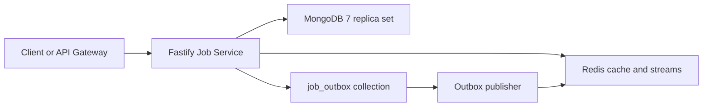

# Job Service Benchmark Results

Use this template for repeatable Job Service performance runs. Capture the
dataset size, schema/index decisions, latency results, and query plans for each
iteration.

## Architecture

```mermaid
flowchart LR
  Client["Client or API Gateway"] --> JobService["Fastify Job Service"]
  JobService --> Mongo["MongoDB 7 replica set"]
  JobService --> Redis["Redis cache and streams"]
  JobService --> Outbox["job_outbox collection"]
  Outbox --> Publisher["Outbox publisher"]
  Publisher --> Redis
```

## Run Context

| Field | Value |
| --- | --- |
| Date | TBD |
| Git commit | TBD |
| Machine | TBD |
| Node version | TBD |
| MongoDB settings | TBD |
| Redis settings | TBD |
| Seed command | TBD |

## Dataset

| Entity | Count | Notes |
| --- | ---: | --- |
| Jobs | TBD | Seeded open/closed job mix |
| Applications | TBD | Distribution per job TBD |
| Event outbox rows | TBD | Sent/unsent split TBD |

## Schema And Index Decisions

| Area | Choice | Reason |
| --- | --- | --- |
| Primary keys | MongoDB `ObjectId` | 12-byte monotonic key with native driver support |
| Cross-service users | Logical `ObjectId` reference only | Keeps Auth service decoupled |
| Job status | String enum plus `$jsonSchema` | Readable in shell and enforced on writes |
| Job list pagination | Keyset `{createdAt, _id}` | Avoids deep offset scans |
| Full-text search | MongoDB text index | Prototype search without Atlas Search dependency |
| Metadata | Embedded sub-document plus `metadata.$**` wildcard index | Keeps flexible metadata queryable |
| Hot reads | Redis cache-aside | Protects database for repeated detail reads |

## Latency Results

| Scenario | Dataset | p50 | p95 | p99 | Notes |
| --- | ---: | ---: | ---: | ---: | --- |
| `GET /v1/jobs` | TBD | TBD | TBD | TBD | Keyset list |
| `GET /v1/jobs?q=...` | TBD | TBD | TBD | TBD | Full-text search |
| `GET /v1/jobs/:id` cache miss | TBD | TBD | TBD | TBD | Primary key lookup |
| `GET /v1/jobs/:id` cache hit | TBD | TBD | TBD | TBD | Redis |
| `POST /v1/jobs/:id/applications` | TBD | TBD | TBD | TBD | Transaction plus outbox |

## Query Plans

Paste `explain("executionStats")` output for the slowest query before and after
each index or query rewrite.

## Iteration Log

| Iteration | Observation | Action | Result |
| --- | --- | --- | --- |
| 1 | TBD | TBD | TBD |

## Next Decisions

- Shard `job_applications` with hashed `jobId` only after the working set no
  longer fits in memory or application volume crosses the planned threshold.
- Move to Atlas Search when text search needs fuzzy matching, autocomplete, or
  p95 search latency exceeds target.
- Revisit `applicationCount` if write conflicts around hot jobs exceed the
  accepted threshold.
